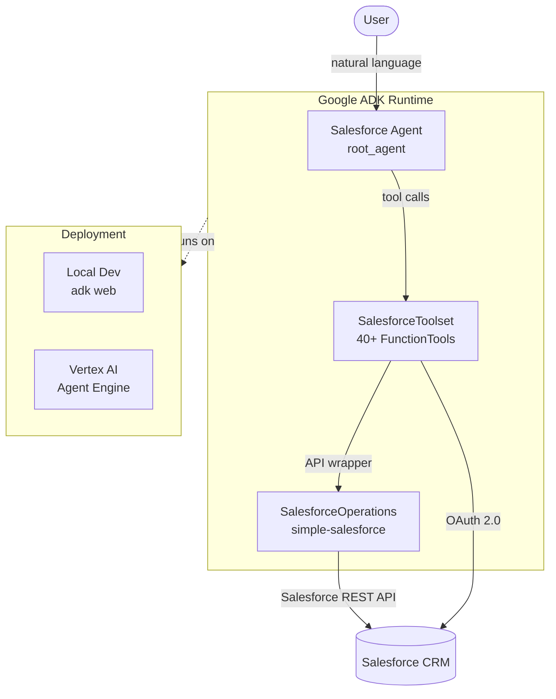
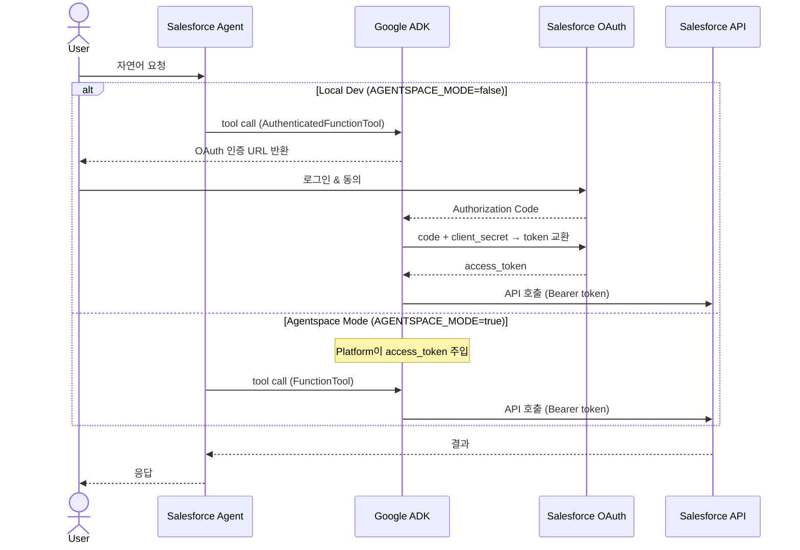
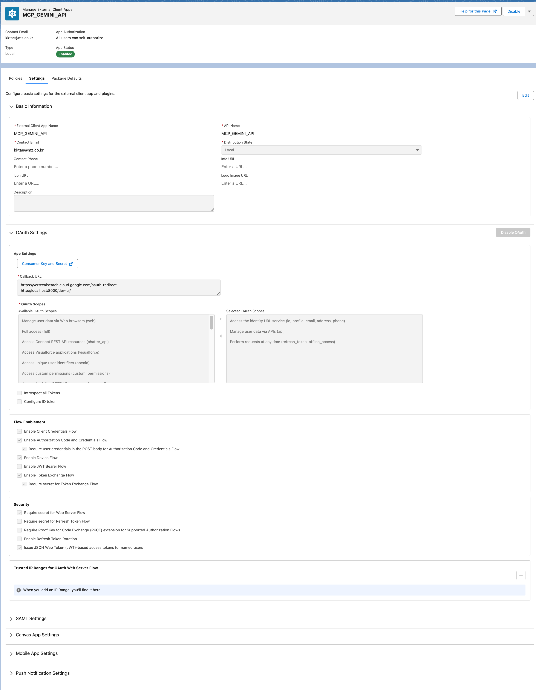

# salesforce-agent

Salesforce CRM을 자연어로 조작하는 AI 에이전트. Google ADK + Gemini 기반.

---

## Architecture



---

## OAuth Flow

두 가지 인증 모드를 지원합니다.



---

## Features

| Category | Capabilities |
|---|---|
| **Query** | SOQL, SOSL, pagination (`query_more`) |
| **Records** | create, read, update, delete, upsert |
| **Metadata** | describe object/fields, list objects |
| **Reports & Dashboards** | sync/async run, refresh, describe |
| **Approvals** | submit, approve/reject, pending list |
| **Bulk & Files** | bulk CRUD, file download |

---

## Prerequisites

- Python 3.14+, [`uv`](https://docs.astral.sh/uv/)
- Google Cloud project (Vertex AI enabled)
- Salesforce Connected App (OAuth 2.0)

---

## Salesforce Setup

Salesforce에서 **External Client App**을 생성하고 아래와 같이 설정합니다.



**OAuth Settings**

| Item | Value |
|---|---|
| Callback URL | `https://vertexaisearch.cloud.google.com/oauth-redirect` |
| Callback URL | `http://localhost:8000/dev-ui/` |
| OAuth Scopes | `api`, `refresh_token`, `id` (identity URL service) |

**Flow Enablement** — 아래 항목을 활성화합니다.

- Enable Client Credentials Flow
- Enable Authorization Code and Credentials Flow
- Require user credentials in the POST body for Authorization Code and Credentials Flow

**Security** — 아래 항목을 활성화합니다.

- Require secret for Web Server Flow
- Require secret for Refresh Token Flow
- Require Proof Key for Code Exchange (PKCE) extension
- Enable Refresh Token Rotation

설정 완료 후 **Key and Secret**을 복사하여 `.env`의 `SALESFORCE_CLIENT_ID`, `SALESFORCE_CLIENT_SECRET`에 입력합니다.

---

## Quick Start

**1. Install**

```bash
uv sync
```

**2. Configure** — `.env` 파일 생성:

```bash
cp .env.example .env
# .env를 열어 필수 값 입력
```

**3. Run**

```bash
uv run adk web
# → http://localhost:8000/dev-ui/
```

---

## Configuration

| Variable | Description | Default |
|---|---|---|
| `VERTEXAI_PROJECT` | Google Cloud project ID | — |
| `VERTEXAI_LOCATION` | Region | `global` |
| `AGENT_MODEL` | Gemini model ID | `gemini-2.0-flash` |
| `SALESFORCE_CLIENT_ID` | Connected App client key | — |
| `SALESFORCE_CLIENT_SECRET` | Connected App client secret | — |
| `SALESFORCE_LOGIN_URL` | Auth endpoint | `https://login.salesforce.com` |
| `SALESFORCE_INSTANCE_URL` | Org instance URL | — |
| `SALESFORCE_API_VERSION` | API version | `65.0` |
| `AGENTSPACE_MODE` | Enable enterprise Agentspace | `false` |

---

## Deployment

Vertex AI Agent Engine에 배포하려면 [`just`](https://github.com/casey/just)를 사용합니다.

```bash
just create --display-name "Salesforce Agent"  # 배포 생성
just update --resource-name <name>             # 업데이트
just list                                      # 배포 목록 조회
just delete --resource-name <name> -y         # 삭제
```
